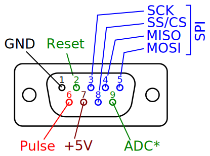

# psi-SLON electrical circuit

psi-SLON is small laboratory electrostimulator.  
This project is a part of [x-SLON project](https://github.com/comcon1/x-SLON).  
Please address the maternal project for detailed description.

Device is very small and is assembled simply. Please consult [assembly.txt](case/assembly.txt).

**Scheme of the device output**

__\*__ - reserve pin connected to ADC0 pin of the ATMEGA (100 kOhm).

# Authors

Ilya Kuzmin <kuzmin.ilya@gmail.com>  
Peter Mamonov <pmamonov@gmail.com>  
Alexey Nesterenko <comcon1@protonmail.com>  

# Licensing

"psi-SLON electrical circuit" project (I. Kuzmin, P. Mamonov, A. Nesterenko)
is released under license CC BY-SA 3.0.
